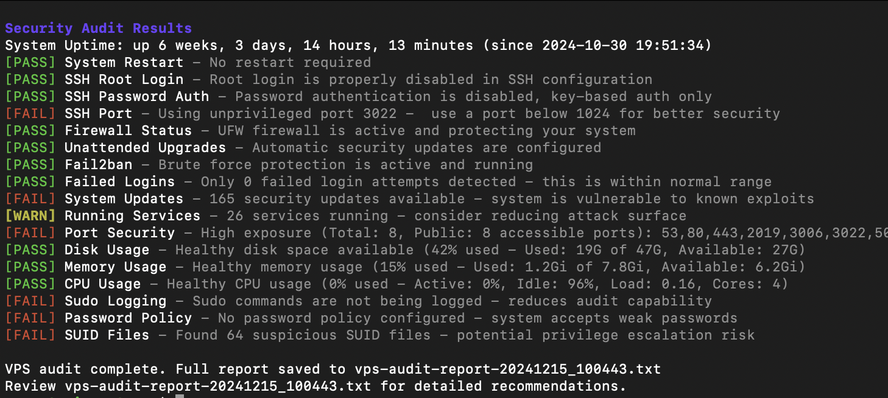

# VPS Security Audit Script

A comprehensive Bash script for auditing the security and performance of your VPS (Virtual Private Server). This tool performs various security checks and provides a detailed report with recommendations for improvements.



## Features

### Security Checks

- SSH Configuration (read from the effective `sshd -T` config)
  - Root login status
  - Password authentication
  - Non-default port usage
- Firewall Status (UFW / firewalld / nftables / iptables, policy-aware)
- Intrusion Prevention (Fail2ban or CrowdSec, host or Docker container)
- Failed Login Attempts (auth.log/secure with rotation, or journald)
- System Updates Status (security vs. non-security)
- Running Services Analysis
- Open Ports Detection (internet-facing vs. loopback)
- Sudo Logging Configuration
- Password Policy Enforcement
- SUID Files Detection (verified against the package database)

### Output

- Human-readable coloured console output + timestamped report file
- Machine-readable JSON via `--json`
- CI/CD-friendly exit codes (see [Usage](#usage))

### Performance Monitoring

- Disk Space Usage
- Memory Usage
- CPU Usage
- Active Internet Connections

## Requirements

- Ubuntu/Debian-based Linux system
- Root access or sudo privileges
- Basic packages (most are pre-installed):
  - ufw
  - systemd
  - netstat
  - grep
  - awk

## Installation

> Because this script runs as **root**, install it from a **tagged release and
> verify the checksum** before running. Do not pipe an unpinned script from
> `main` straight into a root shell.

### Recommended: install a verified release

1. Pick the version you want to install:

   ```bash
   VERSION=v2.1.0
   ```

2. Download the script and its checksum file from that release:

   ```bash
   curl -fsSLO "https://github.com/mylesagnew/vps-audit/releases/download/${VERSION}/vps-audit.sh"
   curl -fsSLO "https://github.com/mylesagnew/vps-audit/releases/download/${VERSION}/SHA256SUMS"
   ```

3. Verify the download matches the published checksum (this must print `OK`):

   ```bash
   sha256sum -c SHA256SUMS --ignore-missing
   ```

4. (Recommended) Verify the signed build-provenance attestation with the
   [GitHub CLI](https://cli.github.com/). This cryptographically confirms the
   file was built by this repository's release workflow (keyless Sigstore
   signing — no key to manage):

   ```bash
   gh attestation verify vps-audit.sh --repo mylesagnew/vps-audit
   # the checksum manifest is signed too:
   gh attestation verify SHA256SUMS --repo mylesagnew/vps-audit
   ```

5. Make it executable:

   ```bash
   chmod +x vps-audit.sh
   ```

### Alternative: clone the repository

For development or the latest unreleased code:

```bash
git clone https://github.com/mylesagnew/vps-audit.git
cd vps-audit
chmod +x scripts/vps-audit.sh
```

The script lives at `scripts/vps-audit.sh` in the repository. The examples below
assume the release layout (`./vps-audit.sh`); adjust the path if you cloned.

## Usage

1. Run the script with root privileges:

   ```bash
   sudo ./vps-audit.sh
   ```

2. Read the real-time, colour-coded results in your terminal:
   - 🟢 `[PASS]` — check passed
   - 🟡 `[WARN]` — potential issue, review it
   - 🔴 `[FAIL]` — critical issue, fix it

3. Review the saved report. By default it is written to
   `vps-audit-report-<TIMESTAMP>.txt` in the current directory with `chmod 600`
   permissions. (`--output` refuses symlinks, existing files, and world-writable
   parent directories without the sticky bit.)

> **No external calls by default.** The audit makes no network requests unless
> you pass `--public-ip`, which fetches the host's public address from
> `api.ipify.org`. This keeps runs safe for air-gapped and compliance-sensitive
> environments.

### Common invocations

```bash
# Standard audit (human-readable report, fully offline):
sudo ./vps-audit.sh

# Include the public-IP lookup (makes one external call to api.ipify.org):
sudo ./vps-audit.sh --public-ip

# Machine-readable output for automation:
sudo ./vps-audit.sh --json > audit.json

# Write the report to a specific path:
sudo ./vps-audit.sh -o /var/log/vps-audit.txt
```

### Options

| Option | Description |
|--------|-------------|
| `--json` | Emit machine-readable JSON to stdout (suppresses the coloured UI). Validates against [`docs/vps-audit.schema.json`](docs/vps-audit.schema.json). |
| `--strict` | Exit non-zero on `WARN` as well as `FAIL`. |
| `--public-ip` | Enable the external public-IP lookup (`api.ipify.org`). Off by default. |
| `--no-public-ip` | Explicitly disable the public-IP lookup (the default; kept for backward compatibility). |
| `--policy FILE` | Load threshold overrides from `FILE` (see [Policy files](#policy-files)). |
| `-o, --output FILE` | Write the report to `FILE`. Refuses symlinks, existing files, and unsafe (world-writable, non-sticky) parent directories. |
| `-h, --help` | Show help and exit. |

### Exit codes (for CI/CD gating)

| Code | Meaning |
|------|---------|
| `0` | No `FAIL` findings (and, unless `--strict`, `WARN` is allowed). |
| `1` | One or more `FAIL` findings (or any `WARN` under `--strict`). |
| `2` | Usage error (unknown flag / missing argument / unsafe `--output` / bad `--policy`). |

`NA` (not applicable, e.g. apt checks on a non-Debian host) never affects the exit code.

Example pipeline step that fails the build on any `FAIL` or `WARN`:

```bash
sudo ./vps-audit.sh --json --strict > audit.json
```

### JSON output

`--json` emits a document validated by [`docs/vps-audit.schema.json`](docs/vps-audit.schema.json).
Each result carries a stable `id`, a `severity` (`critical`/`high`/`medium`/`low`/`info`),
a `remediation` string, and a `status` of `PASS`/`WARN`/`FAIL`/`NA`. The top level
includes `tool` (name/version/commit) for provenance and a `summary` with
`not_applicable` counts. See [`docs/sample-report.md`](docs/sample-report.md).

### Policy files

Thresholds (failed logins, running services, public ports, disk/mem/cpu) can be
tuned per host role without editing the script:

```bash
sudo ./vps-audit.sh --policy config/roles/web.conf
```

Ready-made role policies live in [`config/roles/`](config/roles) (`web`,
`database`, `bastion`); every tunable key and its default is documented in
[`config/vps-audit.example.conf`](config/vps-audit.example.conf). Policy files are
parsed safely (`KEY=INTEGER` only — never sourced), and unknown keys or
non-integer values are rejected.

### Scheduling

For recurring runs, see [`docs/deployment.md`](docs/deployment.md) — it covers a
**systemd** service+timer and a **cron** example, with ready-to-copy unit files
in [`examples/`](examples).

## Output Format

The script provides two types of output:

1. Real-time console output with color coding:

```
[PASS] SSH Root Login - Root login is properly disabled in SSH configuration
[WARN] SSH Port - Using default port 22 - consider changing to a non-standard port
[FAIL] Firewall Status - UFW firewall is not active - your system is exposed
```

2. A detailed report file containing:
   - All check results
   - Specific recommendations for failed checks
   - System resource usage statistics
   - Timestamp of the audit

## Thresholds

### Resource Usage Thresholds

- PASS: < 50% usage
- WARN: 50-80% usage
- FAIL: > 80% usage

### Security Thresholds

- Failed Logins:
  - PASS: < 10 attempts
  - WARN: 10-50 attempts
  - FAIL: > 50 attempts
- Running Services:
  - PASS: < 35 services
  - WARN: 35-60 services
  - FAIL: > 60 services
- Open Ports (counts **internet-facing** ports only; loopback is excluded):
  - PASS: < 3 public ports
  - WARN: 3-4 public ports
  - FAIL: >= 5 public ports
- System Updates:
  - PASS: no pending updates
  - WARN: non-security updates pending
  - FAIL: one or more **security** updates pending

## Customization

You can modify the thresholds by editing the following variables in the script:

- Resource usage thresholds
- Failed login attempt thresholds
- Service count thresholds
- Open port thresholds

## Best Practices

1. Run the audit regularly (e.g., weekly) to maintain security
2. Review the generated report thoroughly
3. Address any FAIL status immediately
4. Investigate WARN status during maintenance
5. Keep the script updated with your security policies

## Limitations

- Designed for Debian/Ubuntu-based systems
- Requires root/sudo access
- Some checks may need customization for specific environments
- Not a replacement for professional security audit

## Development

The repository is laid out as:

```
.
├── scripts/vps-audit.sh          # the audit script
├── config/                       # policy files (example + web/database/bastion roles)
├── examples/                     # systemd service+timer and cron examples
├── tests/bats/                   # Bats test suite
├── docs/                         # screenshot, sample report, JSON schema, deployment
└── .github/workflows/            # lint.yml (CI) + release.yml (signed releases)
```

To run the checks locally:

1. Install the tooling:

   ```bash
   sudo apt-get install -y shellcheck bats
   # shfmt: https://github.com/mvdan/sh/releases
   ```

2. Lint and format-check the script:

   ```bash
   shellcheck -S style scripts/vps-audit.sh
   shfmt -d -i 4 -ci -bn scripts/vps-audit.sh
   ```

3. Run the test suite:

   ```bash
   bats tests/bats
   ```

## Contributing

Feel free to submit issues and enhancement requests! Please run the checks in
[Development](#development) before opening a pull request.

## License

This project is licensed under the MIT License - see the LICENSE file for details.

## Security Notice

While this script helps identify common security issues, it should not be your only security measure. Always:

- Keep your system updated
- Monitor logs regularly
- Follow security best practices
- Consider professional security audits for critical systems

## Support

For support, please:

1. Check the existing issues
2. Create a new issue with detailed information
3. Provide the output of the script and your system information

Stay secure! 🔒
